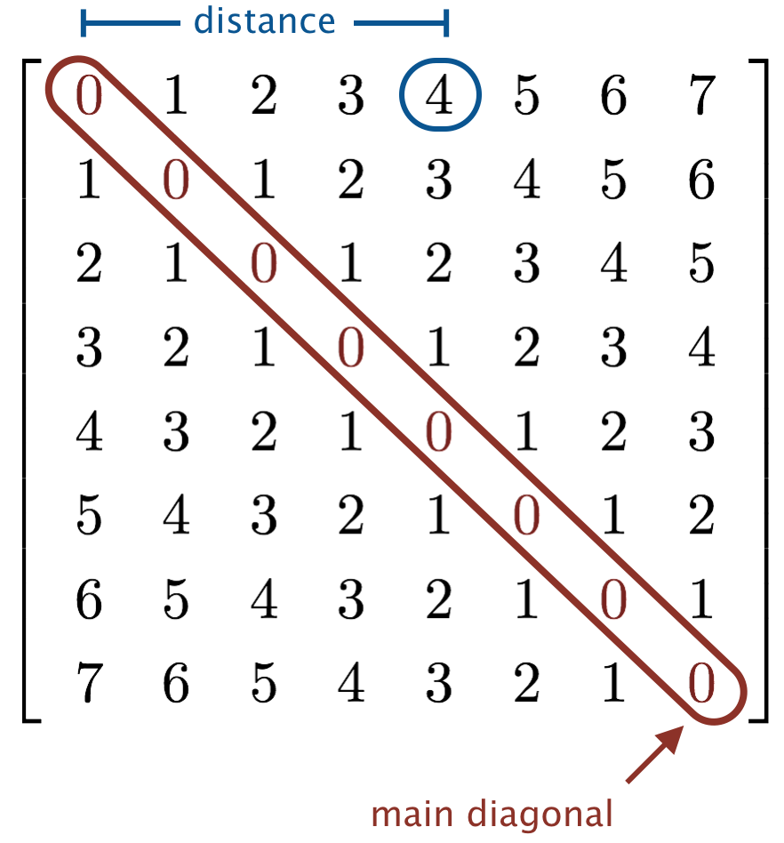

# Band Matrix Generator

A Java program that generates n×n band matrix patterns with specified width.

## **Pattern Definition**
For an n×n matrix:
- `*` appears when |row - column| ≤ width
- `0` appears when |row - column| > width
- Elements are separated by two spaces

##Example:
<blockquote>

</blockquote>


## **Usage**
1. **Compile** the program:
   ```bash
   javac BandMatrix.java
   ```
2. **Run** with two integer arguments:
   ```bash
   java BandMatrix n width
   ```
   - `n`: Matrix dimension (non-negative integer)
   - `width`: Band width (non-negative integer)

## **Examples**
```bash
$ java BandMatrix 5 1
*  *  0  0  0  
*  *  *  0  0  
0  *  *  *  0  
0  0  *  *  *  
0  0  0  *  *  

$ java BandMatrix 4 2
*  *  *  0  
*  *  *  *  
*  *  *  *  
0  *  *  *  
```

## **Implementation Details**
- Uses nested loops to traverse rows and columns
- Calculates Manhattan distance from main diagonal
- Prints `*` or `0` based on width comparison
- Maintains consistent two-space separation

## **Notes**
- Valid for non-negative integer inputs
- When width ≥ n-1, outputs all `*` (full matrix)
- When width = 0, outputs identity matrix pattern
